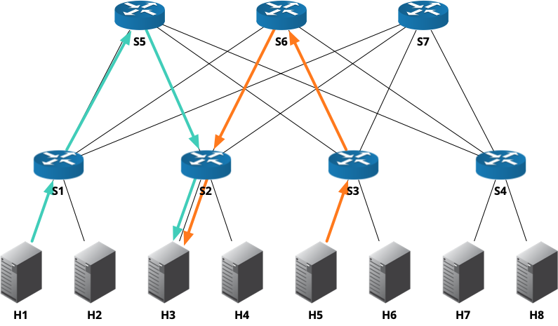

# microburst-mitigator

## 拓扑结构



## 常用命令

```bash
ssh -Y zwx@10.211.55.4
```

```bash
sudo p4run --config p4app-fattree.json
```

BMv2 Mininet CLI:

```bash
xterm h1 h3 h5
```
第一个 H3:（Receiver）

```bash
cd host; python receive.py
```

第二个 H3：（Receiver）

```bash
iperf -s
```

H5：（Burst）

```bash
cd host; python send.py 10.2.3.2 10000 500
```

参数说明：

+ 参数 1 - `<destination>`：接收方 IPv4 地址
+ 参数 2 - `<pps>`：每秒发送多少个分组数据包（常用的网络吞吐率的单位），即发包速度
+ 参数 3 - `<loop>`：循环次数，即发包数量

H1：（Background）

```bash
iperf -c 10.2.3.2 -i 1 -t 30 -b 4M
```


## 参考

+ [The BMv2 Simple Switch target](https://github.com/p4lang/behavioral-model/blob/main/docs/simple_switch.md#pseudocode-for-what-happens-at-the-end-of-ingress-and-egress-processing)
+ [Congestion Aware Load Balancing](https://github.com/nsg-ethz/p4-learning/tree/master/exercises/10-Congestion_Aware_Load_Balancing)
+ [Burstradar](https://github.com/harshgondaliya/burstradar/blob/master/burstradar.p4)
 